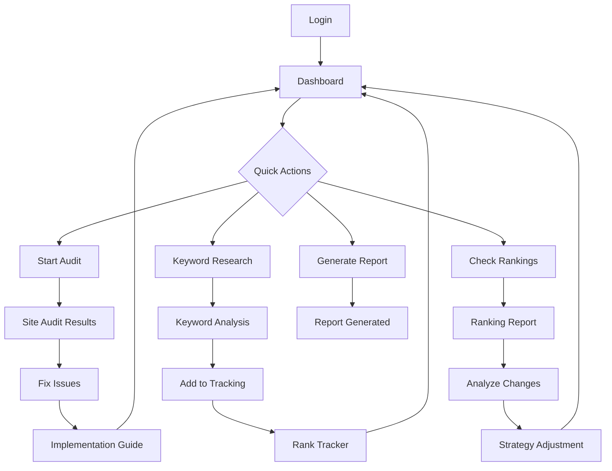

## 1. Product Overview
A comprehensive SEO automation platform that replicates and enhances specialist-level SEO functions through AI-powered tools and automated workflows. The application serves digital marketers, SEO professionals, and website owners who need enterprise-grade SEO capabilities without manual complexity.

The platform solves the problem of time-intensive SEO tasks by providing automated keyword research, technical auditing, content optimization, and performance tracking with AI-driven insights and recommendations.

## 2. Core Features

### 2.1 User Roles
| Role | Registration Method | Core Permissions |
|------|---------------------|------------------|
| Free User | Email registration | Basic keyword research (10 queries/day), limited audits, standard reports |
| Professional | Subscription upgrade | Unlimited research, advanced audits, AI recommendations, API access, white-label reports |
| Enterprise | Custom onboarding | Multi-user access, custom integrations, dedicated support, advanced analytics |

### 2.2 Feature Module
Our SEO automation platform consists of the following main pages:
1. **Dashboard**: Overview of all SEO projects, key metrics, recent activities, and quick actions
2. **Keyword Research**: Automated keyword discovery, competitive analysis, search volume trends
3. **Site Audit**: Technical SEO crawler, issue detection, priority scoring, fix recommendations
4. **Content Optimizer**: On-page analysis, content scoring, improvement suggestions, AI rewriting
5. **Rank Tracker**: SERP monitoring, position tracking, competitor comparison, trend analysis
6. **Backlink Analyzer**: Link profile analysis, quality assessment, opportunity finder
7. **Local SEO**: Google Business Profile management, citation tracking, local ranking monitoring
8. **Reports**: Automated report generation, custom dashboards, export capabilities
9. **Project Setup**: Step-by-step wizard for new website configuration
10. **Settings**: Account management, API keys, notification preferences, billing

### 2.3 Page Details
| Page Name | Module Name | Feature description |
|-----------|-------------|---------------------|
| Dashboard | Project Overview | Display active projects, total keywords tracked, site health score, recent audits. Show traffic trends and ranking changes with interactive charts. |
| Dashboard | Quick Actions | One-click access to common tasks: start audit, add keywords, generate report, check rankings. Include AI assistant chat widget. |
| Keyword Research | Keyword Discovery | Enter seed keywords to generate related terms, questions, and long-tail variations. Show search volume, difficulty, CPC, and trend data. |
| Keyword Research | Competitive Analysis | Analyze competitor domains to extract their ranking keywords, content gaps, and traffic sources. Compare up to 5 competitors side-by-side. |
| Keyword Research | Keyword Clustering | Group related keywords by semantic similarity and search intent. Generate content briefs for each cluster with AI recommendations. |
| Site Audit | Technical Crawler | Crawl websites up to 10,000 pages to identify technical issues: broken links, redirect chains, duplicate content, page speed issues. |
| Site Audit | Issue Prioritization | Score issues by impact and difficulty to fix. Provide step-by-step instructions for each problem with code examples and best practices. |
| Site Audit | Schema Generator | Create and validate structured data markup for articles, products, local business, FAQs. Test implementation with Google's validator. |
| Content Optimizer | On-Page Analysis | Analyze existing pages for keyword usage, readability, meta tags, header structure. Provide optimization score and specific improvements. |
| Content Optimizer | AI Content Assistant | Generate SEO-optimized content outlines, expand sections, rewrite for better keyword integration while maintaining natural language flow. |
| Content Optimizer | Content Briefs | Create detailed content briefs with target keywords, search intent analysis, recommended structure, and competitor content gaps. |
| Rank Tracker | Position Monitoring | Track keyword positions across multiple search engines and locations. Update daily with historical trend visualization and change alerts. |
| Rank Tracker | SERP Features | Monitor featured snippets, local packs, image results, and other SERP features. Track visibility share and optimization opportunities. |
| Rank Tracker | Competitor Tracking | Monitor competitor rankings for shared keywords. Identify ranking gains/losses and analyze successful content strategies. |
| Backlink Analyzer | Link Profile | Analyze total backlinks, referring domains, anchor text distribution, and link quality metrics. Identify toxic links for disavowal. |
| Backlink Analyzer | Opportunity Finder | Discover link building opportunities through competitor analysis, broken link building, and unlinked brand mentions. |
| Backlink Analyzer | Link Monitoring | Track new and lost backlinks with email alerts. Monitor link health and identify potential negative SEO attacks. |
| Local SEO | GBP Management | Connect and manage Google Business Profile listings. Track views, clicks, and customer actions with performance insights. |
| Local SEO | Citation Tracker | Monitor business listings across 100+ directories. Identify inconsistent NAP (Name, Address, Phone) information and submission opportunities. |
| Local SEO | Local Rankings | Track local pack rankings for target keywords in specific geographic areas. Compare performance across different locations. |
| Reports | Automated Reports | Schedule weekly/monthly reports with custom metrics and branding. Include executive summaries and actionable recommendations. |
| Reports | White-Label Export | Generate PDF reports with custom logos and colors. Export data to CSV, Excel, or Google Sheets for further analysis. |
| Project Setup | Site Configuration | Step-by-step wizard for adding new websites including domain verification, analytics connection, and initial crawl setup. |
| Project Setup | Goal Setting | Define SEO objectives, target keywords, and success metrics. Set up automated alerts for goal achievement or issues. |

## 3. Core Process

### New User Flow
1. User registers account and selects subscription tier
2. Completes onboarding tutorial with sample project
3. Adds first website through setup wizard
4. Runs initial site audit and keyword research
5. Sets up rank tracking for target keywords
6. Reviews AI-generated optimization recommendations
7. Implements suggested improvements or schedules tasks
8. Monitors progress through dashboard and reports

### Regular User Flow
1. Login to dashboard showing project overview
2. Check alerts for critical issues or ranking changes
3. Review automated audit results and prioritize fixes
4. Monitor keyword rankings and competitor performance
5. Generate and share reports with stakeholders
6. Use AI assistant for content optimization tasks

## 4. User Interface Design

### 4.1 Design Style
- **Primary Colors**: Deep blue (#1E40AF) for primary actions, emerald (#10B981) for success states, amber (#F59E0B) for warnings
- **Secondary Colors**: Gray scale for backgrounds and text, with subtle gradients for depth
- **Button Style**: Rounded corners (8px radius), subtle shadows, hover animations, clear call-to-action hierarchy
- **Typography**: Inter font family, 16px base size, clear hierarchy with H1-H6 sizing
- **Layout**: Card-based design with consistent spacing (8px grid system), sidebar navigation for desktop
- **Icons**: Heroicons for consistency, with custom SEO-themed icons for specialized features
- **Animations**: Smooth transitions (200-300ms), loading skeletons, progress indicators for long-running tasks

### 4.2 Page Design Overview
| Page Name | Module Name | UI Elements |
|------------|-------------|-------------|
| Dashboard | Project Cards | Grid layout with project cards showing health scores, traffic metrics, and quick stats. Color-coded indicators for issues requiring attention. |
| Dashboard | Metrics Charts | Interactive charts using Chart.js with hover details, time range selectors, and export options. Responsive design that stacks on mobile. |
| Keyword Research | Search Interface | Large search input with autocomplete, filter pills for search parameters, and tabbed results view for different keyword types. |
| Keyword Research | Results Table | Sortable columns with inline sparklines for trends, difficulty indicators with color coding, and bulk action buttons. |
| Site Audit | Issue List | Expandable accordion items showing issue severity, affected pages count, and fix difficulty. Progress tracking for completed fixes. |
| Site Audit | Crawl Visualization | Interactive site map showing crawl depth, issue distribution, and page relationships. Zoom and filter capabilities. |
| Content Optimizer | Editor Interface | Side-by-side view with original content and AI suggestions. Real-time scoring updates as content is modified. |
| Rank Tracker | Position Chart | Line chart showing ranking positions over time with competitor overlay. SERP feature indicators and change alerts. |

### 4.3 Responsiveness
- **Desktop-First Design**: Optimized for 1920x1080 and 1366x768 resolutions
- **Mobile Adaptation**: Responsive breakpoints at 768px and 480px with touch-friendly controls
- **Tablet Optimization**: Landscape and portrait modes with appropriate navigation patterns
- **Touch Interactions**: Swipe gestures for chart navigation, pinch-to-zoom for visualizations

### 4.4 Data Visualization Guidelines
- **Chart Types**: Line charts for trends, bar charts for comparisons, pie charts for distributions
- **Color Accessibility**: WCAG 2.1 AA compliant color contrast, colorblind-friendly palettes
- **Interactive Elements**: Hover states, clickable legends, zoom and pan capabilities
- **Loading States**: Skeleton screens during data fetching, progress bars for long operations