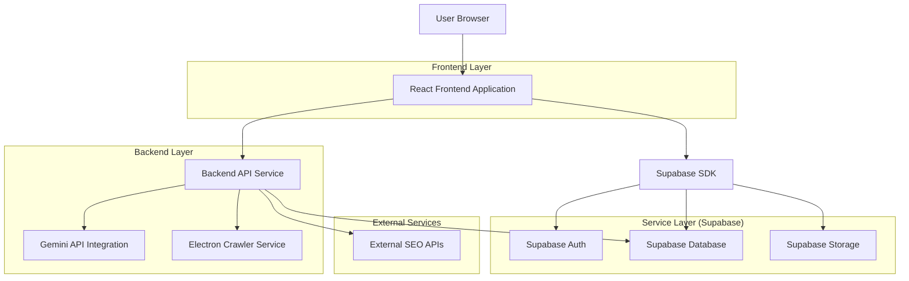
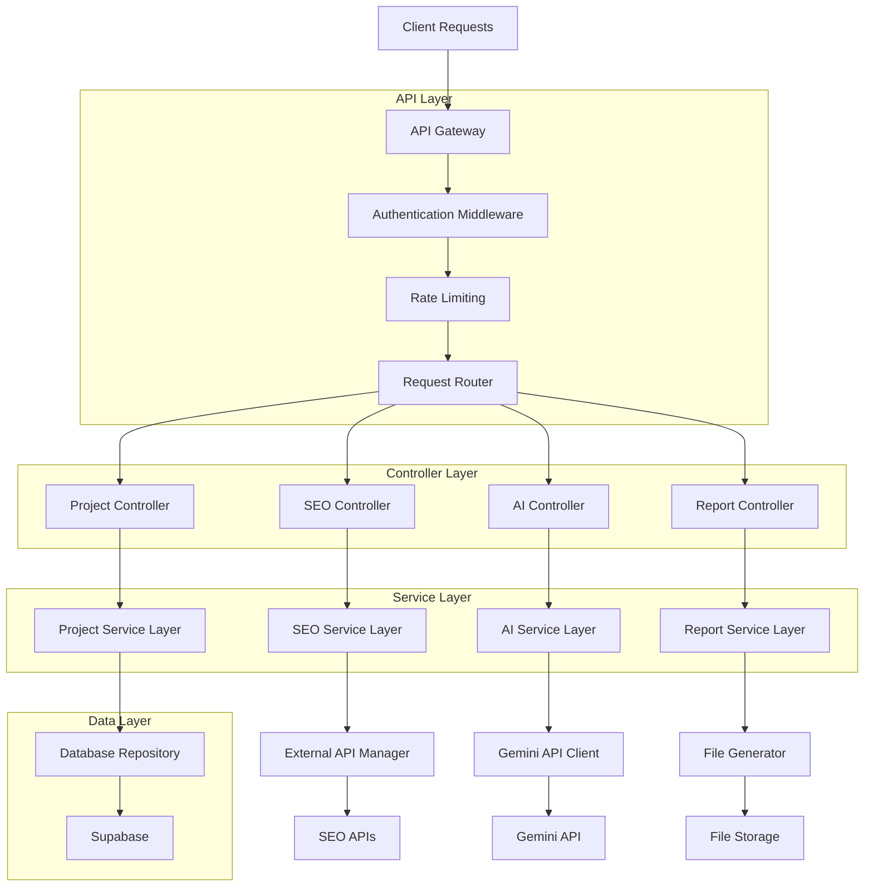
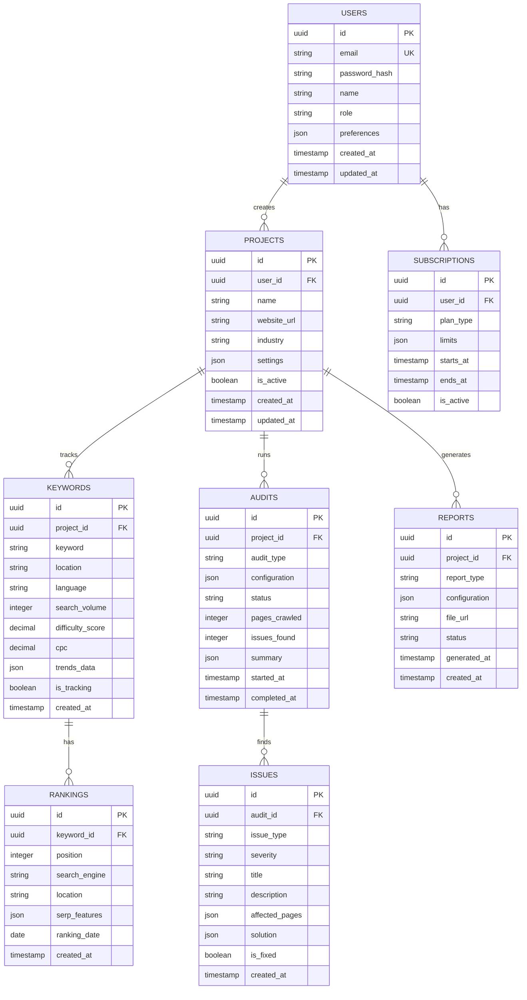
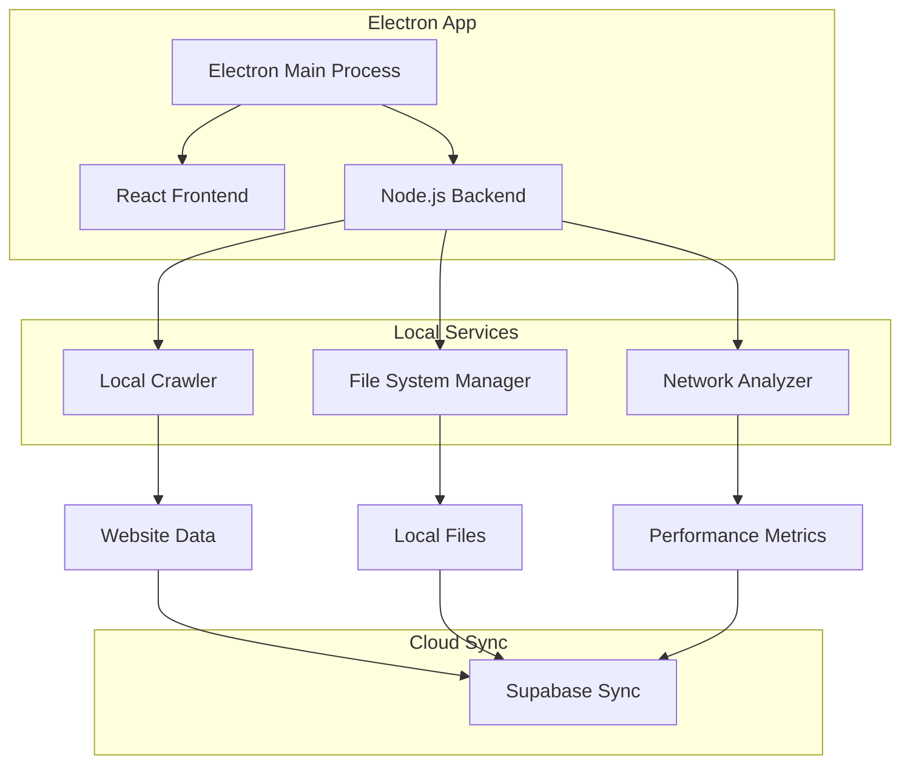

## 1. Architecture Design



## 2. Technology Description

- **Frontend**: React@18 + TypeScript + Tailwind CSS@3 + Vite
- **Initialization Tool**: vite-init
- **Backend**: Node.js@18 + Express@4 + TypeScript
- **Database**: Supabase (PostgreSQL)
- **Authentication**: Supabase Auth
- **AI Integration**: Google Gemini API
- **Desktop Integration**: Electron@27
- **State Management**: Zustand
- **UI Components**: Headless UI + Radix UI
- **Charts**: Chart.js + React Chart.js 2
- **Forms**: React Hook Form + Zod validation
- **HTTP Client**: Axios
- **Scheduling**: node-cron
- **File Processing**: Papa Parse (CSV), ExcelJS

## 3. Route Definitions

| Route | Purpose |
|-------|---------|
| / | Landing page with product overview and pricing |
| /auth/login | User authentication login page |
| /auth/register | User registration page |
| /dashboard | Main dashboard showing project overview and metrics |
| /projects | Project management and listing |
| /projects/new | New project setup wizard |
| /projects/:id | Individual project dashboard |
| /keyword-research | Keyword research and analysis tools |
| /site-audit | Technical SEO auditing interface |
| /content-optimizer | Content optimization and AI writing tools |
| /rank-tracker | SERP position tracking and monitoring |
| /backlink-analyzer | Backlink profile analysis and monitoring |
| /local-seo | Local SEO and Google Business Profile management |
| /reports | Report generation and management |
| /settings/account | User account settings and preferences |
| /settings/billing | Subscription and billing management |
| /settings/api | API key management and documentation |
| /help | Documentation, tutorials, and support |

## 4. API Definitions

### 4.1 Authentication APIs

**User Registration**
```
POST /api/auth/register
```

Request:
| Param Name | Param Type | isRequired | Description |
|------------|------------|-------------|-------------|
| email | string | true | User email address |
| password | string | true | User password (min 8 characters) |
| name | string | true | Full name |
| company | string | false | Company name (optional) |

Response:
| Param Name | Param Type | Description |
|------------|-------------|-------------|
| user | object | User object with id, email, name |
| session | object | Authentication session token |

### 4.2 SEO Analysis APIs

**Start Site Audit**
```
POST /api/seo/audit/start
```

Request:
| Param Name | Param Type | isRequired | Description |
|------------|------------|-------------|-------------|
| project_id | string | true | Project UUID |
| website_url | string | true | Website URL to audit |
| crawl_depth | number | false | Maximum crawl depth (default: 3) |
| page_limit | number | false | Maximum pages to crawl (default: 1000) |

Response:
| Param Name | Param Type | Description |
|------------|-------------|-------------|
| audit_id | string | Unique audit identifier |
| status | string | Audit status (queued/running/completed) |
| estimated_time | number | Estimated completion time in minutes |

**Keyword Research**
```
POST /api/seo/keywords/research
```

Request:
| Param Name | Param Type | isRequired | Description |
|------------|------------|-------------|-------------|
| seed_keywords | array | true | Array of seed keywords |
| location | string | false | Geographic location (default: "global") |
| language | string | false | Language code (default: "en") |
| include_trends | boolean | false | Include search trends data |

Response:
| Param Name | Param Type | Description |
|------------|-------------|-------------|
| keywords | array | Array of keyword objects with metrics |
| total_results | number | Total keywords found |
| search_time | number | API processing time |

### 4.3 AI Integration APIs

**Generate Content Brief**
```
POST /api/ai/content-brief
```

Request:
| Param Name | Param Type | isRequired | Description |
|------------|------------|-------------|-------------|
| target_keyword | string | true | Primary target keyword |
| related_keywords | array | false | Related keywords to include |
| content_type | string | true | Type: "blog", "product", "service" |
| word_count | number | false | Target word count (default: 1500) |

Response:
| Param Name | Param Type | Description |
|------------|-------------|-------------|
| brief | object | Content brief with structure and recommendations |
| outline | array | Hierarchical content outline |
| key_points | array | Important points to cover |

**SEO Recommendations**
```
POST /api/ai/recommendations
```

Request:
| Param Name | Param Type | isRequired | Description |
|------------|------------|-------------|-------------|
| audit_data | object | true | Site audit results |
| competitor_data | object | false | Competitor analysis data |
| industry | string | false | Industry/business type |

Response:
| Param Name | Param Type | Description |
|------------|-------------|-------------|
| recommendations | array | Prioritized SEO recommendations |
| impact_scores | object | Expected impact for each recommendation |
| implementation_guides | object | Step-by-step implementation guides |

## 5. Server Architecture Diagram



## 6. Data Model

### 6.1 Database Schema



### 6.2 Data Definition Language

**Users Table**
```sql
CREATE TABLE users (
    id UUID PRIMARY KEY DEFAULT gen_random_uuid(),
    email VARCHAR(255) UNIQUE NOT NULL,
    password_hash VARCHAR(255) NOT NULL,
    name VARCHAR(100) NOT NULL,
    role VARCHAR(20) DEFAULT 'user' CHECK (role IN ('user', 'admin')),
    preferences JSONB DEFAULT '{}',
    created_at TIMESTAMP WITH TIME ZONE DEFAULT NOW(),
    updated_at TIMESTAMP WITH TIME ZONE DEFAULT NOW()
);

CREATE INDEX idx_users_email ON users(email);
```

**Projects Table**
```sql
CREATE TABLE projects (
    id UUID PRIMARY KEY DEFAULT gen_random_uuid(),
    user_id UUID REFERENCES users(id) ON DELETE CASCADE,
    name VARCHAR(200) NOT NULL,
    website_url VARCHAR(500) NOT NULL,
    industry VARCHAR(100),
    settings JSONB DEFAULT '{}',
    is_active BOOLEAN DEFAULT true,
    created_at TIMESTAMP WITH TIME ZONE DEFAULT NOW(),
    updated_at TIMESTAMP WITH TIME ZONE DEFAULT NOW()
);

CREATE INDEX idx_projects_user_id ON projects(user_id);
CREATE INDEX idx_projects_is_active ON projects(is_active);
```

**Keywords Table**
```sql
CREATE TABLE keywords (
    id UUID PRIMARY KEY DEFAULT gen_random_uuid(),
    project_id UUID REFERENCES projects(id) ON DELETE CASCADE,
    keyword VARCHAR(200) NOT NULL,
    location VARCHAR(100) DEFAULT 'global',
    language VARCHAR(10) DEFAULT 'en',
    search_volume INTEGER,
    difficulty_score DECIMAL(3,2),
    cpc DECIMAL(10,2),
    trends_data JSONB,
    is_tracking BOOLEAN DEFAULT true,
    created_at TIMESTAMP WITH TIME ZONE DEFAULT NOW(),
    UNIQUE(project_id, keyword, location, language)
);

CREATE INDEX idx_keywords_project_id ON keywords(project_id);
CREATE INDEX idx_keywords_is_tracking ON keywords(is_tracking);
```

**Rankings Table**
```sql
CREATE TABLE rankings (
    id UUID PRIMARY KEY DEFAULT gen_random_uuid(),
    keyword_id UUID REFERENCES keywords(id) ON DELETE CASCADE,
    position INTEGER NOT NULL,
    search_engine VARCHAR(50) DEFAULT 'google',
    location VARCHAR(100) DEFAULT 'global',
    serp_features JSONB DEFAULT '[]',
    ranking_date DATE NOT NULL,
    created_at TIMESTAMP WITH TIME ZONE DEFAULT NOW(),
    UNIQUE(keyword_id, search_engine, location, ranking_date)
);

CREATE INDEX idx_rankings_keyword_id ON rankings(keyword_id);
CREATE INDEX idx_rankings_date ON rankings(ranking_date);
CREATE INDEX idx_rankings_position ON rankings(position);
```

**Audits Table**
```sql
CREATE TABLE audits (
    id UUID PRIMARY KEY DEFAULT gen_random_uuid(),
    project_id UUID REFERENCES projects(id) ON DELETE CASCADE,
    audit_type VARCHAR(50) NOT NULL,
    configuration JSONB DEFAULT '{}',
    status VARCHAR(20) DEFAULT 'pending' CHECK (status IN ('pending', 'running', 'completed', 'failed')),
    pages_crawled INTEGER DEFAULT 0,
    issues_found INTEGER DEFAULT 0,
    summary JSONB,
    started_at TIMESTAMP WITH TIME ZONE,
    completed_at TIMESTAMP WITH TIME ZONE,
    created_at TIMESTAMP WITH TIME ZONE DEFAULT NOW()
);

CREATE INDEX idx_audits_project_id ON audits(project_id);
CREATE INDEX idx_audits_status ON audits(status);
CREATE INDEX idx_audits_created_at ON audits(created_at DESC);
```

**Issues Table**
```sql
CREATE TABLE issues (
    id UUID PRIMARY KEY DEFAULT gen_random_uuid(),
    audit_id UUID REFERENCES audits(id) ON DELETE CASCADE,
    issue_type VARCHAR(100) NOT NULL,
    severity VARCHAR(20) CHECK (severity IN ('critical', 'high', 'medium', 'low')),
    title VARCHAR(300) NOT NULL,
    description TEXT,
    affected_pages JSONB DEFAULT '[]',
    solution JSONB,
    is_fixed BOOLEAN DEFAULT false,
    created_at TIMESTAMP WITH TIME ZONE DEFAULT NOW()
);

CREATE INDEX idx_issues_audit_id ON issues(audit_id);
CREATE INDEX idx_issues_severity ON issues(severity);
CREATE INDEX idx_issues_is_fixed ON issues(is_fixed);
```

**Row Level Security (RLS) Policies**
```sql
-- Enable RLS
ALTER TABLE projects ENABLE ROW LEVEL SECURITY;
ALTER TABLE keywords ENABLE ROW LEVEL SECURITY;
ALTER TABLE rankings ENABLE ROW LEVEL SECURITY;
ALTER TABLE audits ENABLE ROW LEVEL SECURITY;
ALTER TABLE issues ENABLE ROW LEVEL SECURITY;
ALTER TABLE reports ENABLE ROW LEVEL SECURITY;

-- Projects policies
CREATE POLICY "Users can view own projects" ON projects
    FOR SELECT USING (auth.uid() = user_id);

CREATE POLICY "Users can create own projects" ON projects
    FOR INSERT WITH CHECK (auth.uid() = user_id);

CREATE POLICY "Users can update own projects" ON projects
    FOR UPDATE USING (auth.uid() = user_id);

CREATE POLICY "Users can delete own projects" ON projects
    FOR DELETE USING (auth.uid() = user_id);

-- Keywords policies (cascade from projects)
CREATE POLICY "Users can manage project keywords" ON keywords
    FOR ALL USING (
        EXISTS (
            SELECT 1 FROM projects 
            WHERE projects.id = keywords.project_id 
            AND projects.user_id = auth.uid()
        )
    );

-- Grant permissions
GRANT SELECT ON projects TO anon;
GRANT ALL ON projects TO authenticated;
GRANT SELECT ON keywords TO anon;
GRANT ALL ON keywords TO authenticated;
```

## 7. Electron Integration

### 7.1 Local Crawler Service
The Electron application provides enhanced capabilities for local SEO operations:

**Features:**
- **Local Website Crawler**: Deep crawling without CORS limitations
- **File System Access**: Direct access to sitemap files, robots.txt
- **Network Analysis**: Page load speed testing, resource optimization
- **Screenshot Capture**: Visual comparison of page rendering
- **Batch Operations**: Process multiple files locally
- **Offline Mode**: Continue working without internet connection

**Architecture:**


**Security Considerations:**
- Sandboxed crawler execution
- Rate limiting for external requests
- Secure storage of API keys
- Local data encryption
- User permission management for file access