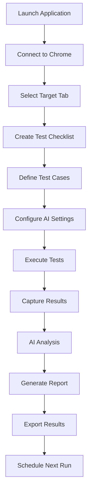

## 1. Product Overview
A cross-platform desktop application that performs rigorous automated testing of web applications using AI-powered analysis. The application enables users to select Chrome tabs, create comprehensive test flows, and generate detailed reports with Gemini AI integration.

Target users: QA engineers, developers, and product teams who need automated web application testing with intelligent analysis and reporting capabilities.

## 2. Core Features

### 2.1 User Roles
| Role | Registration Method | Core Permissions |
|------|---------------------|------------------|
| Tester | Local account creation | Create and execute tests, view reports |
| Admin | System administrator | Full access including system settings, user management |

### 2.2 Feature Module
The web application testing tool consists of the following main pages:
1. **Dashboard**: Project overview, recent test runs, quick actions
2. **Tab Selection**: Chrome tab browser, tab preview, connection management
3. **Test Designer**: Checklist creation, test case builder, flow organization
4. **Test Runner**: Live execution monitor, progress tracking, real-time results
5. **Reports**: Test results analysis, AI-generated insights, export options
6. **Settings**: Application preferences, API configuration, system settings

### 2.3 Page Details
| Page Name | Module Name | Feature description |
|-----------|-------------|---------------------|
| Dashboard | Project Overview | Display active projects, test statistics, and recent activity summary |
| Dashboard | Quick Actions | Provide shortcuts to create new tests, run existing tests, and view reports |
| Dashboard | Activity Feed | Show recent test executions with status indicators and timestamps |
| Tab Selection | Chrome Integration | Connect to running Chrome instances and enumerate available tabs |
| Tab Selection | Tab Preview | Display live preview of selected tabs with basic interaction capabilities |
| Tab Selection | Tab Management | Allow users to refresh, close, or switch between tabs |
| Test Designer | Checklist Builder | Create hierarchical test cases with expected behaviors and validation criteria |
| Test Designer | Test Flow Organizer | Arrange test cases into logical sequences and groups |
| Test Designer | AI Assistant | Use natural language to generate test cases from descriptions |
| Test Runner | Execution Monitor | Display real-time progress of test execution with status updates |
| Test Runner | Live Interaction | Show automated interactions happening on the web application |
| Test Runner | Pause/Resume | Allow manual intervention during test execution |
| Reports | Results Summary | Display pass/fail statistics with visual indicators |
| Reports | AI Analysis | Show Gemini AI-generated insights about application behavior |
| Reports | Detailed Logs | Provide comprehensive logs with screenshots and performance metrics |
| Reports | Export Options | Generate reports in HTML, PDF, and JSON formats |
| Settings | API Configuration | Manage Gemini AI API key and connection settings |
| Settings | Test Preferences | Configure default test timeouts, retry attempts, and thresholds |
| Settings | System Settings | Adjust application behavior, update checks, and privacy options |

## 3. Core Process

### Main User Flow
1. User launches application and connects to Chrome browser
2. User selects target web application tab from available Chrome instances
3. User creates test checklist using visual interface or AI assistance
4. User defines expected behaviors and validation criteria for each test case
5. User initiates test execution with automated browser interactions
6. System captures screenshots, performance metrics, and logs during execution
7. Gemini AI analyzes results and generates comprehensive test report
8. User reviews detailed report with pass/fail status and recommendations
9. User exports reports in preferred format for sharing and documentation

### Advanced User Flow
1. User schedules automated test runs for continuous monitoring
2. User compares current results with historical test data
3. User adjusts test thresholds based on application evolution
4. User collaborates with team by sharing test configurations and results

## 4. User Interface Design

### 4.1 Design Style
- **Primary Colors**: macOS-inspired palette with system blue (#007AFF) as primary, system gray (#8E8E93) as secondary
- **Button Style**: Native macOS buttons with rounded corners and subtle shadows
- **Font**: San Francisco (SF Pro) for macOS, system fonts for other platforms
- **Layout Style**: Sidebar navigation with main content area, card-based components
- **Icons**: SF Symbols for macOS, Material Design icons for cross-platform consistency
- **Animation**: Smooth transitions with native system feel, subtle hover effects

### 4.2 Page Design Overview
| Page Name | Module Name | UI Elements |
|-----------|-------------|-------------|
| Dashboard | Project Overview | Grid layout with project cards, status badges, progress indicators using native macOS styling |
| Dashboard | Quick Actions | Large, touch-friendly buttons with icons and descriptive text, arranged in responsive grid |
| Tab Selection | Chrome Integration | List view with tab thumbnails, connection status indicators, search/filter functionality |
| Tab Selection | Tab Preview | Resizable preview pane with zoom controls, interaction overlay indicators |
| Test Designer | Checklist Builder | Drag-and-drop interface with collapsible sections, color-coded test categories |
| Test Designer | Test Flow Organizer | Visual flowchart-style interface with connecting lines and conditional branches |
| Test Runner | Execution Monitor | Real-time progress bar, status icons, execution timeline with expandable details |
| Test Runner | Live Interaction | Split view showing test script and live browser preview side-by-side |
| Reports | Results Summary | Dashboard-style cards with charts, pass/fail pie charts, trend indicators |
| Reports | AI Analysis | Conversation-style interface with Gemini AI responses, highlighted insights |
| Reports | Detailed Logs | Collapsible log entries with timestamp filtering, screenshot thumbnails |
| Settings | API Configuration | Secure input fields with validation, connection test button, usage statistics |

### 4.3 Responsiveness
- Desktop-first design optimized for 13-inch and larger displays
- Adaptive layout for different screen sizes and resolutions
- Touch interaction support for trackpad and touchscreen devices
- Keyboard navigation and shortcuts for power users
- High DPI display support with proper scaling

### 4.4 Cross-Platform Considerations
- Native window controls and system integration for each platform
- Platform-specific menu bars and keyboard shortcuts
- Consistent core functionality across all supported operating systems
- Adaptive styling that respects system appearance preferences