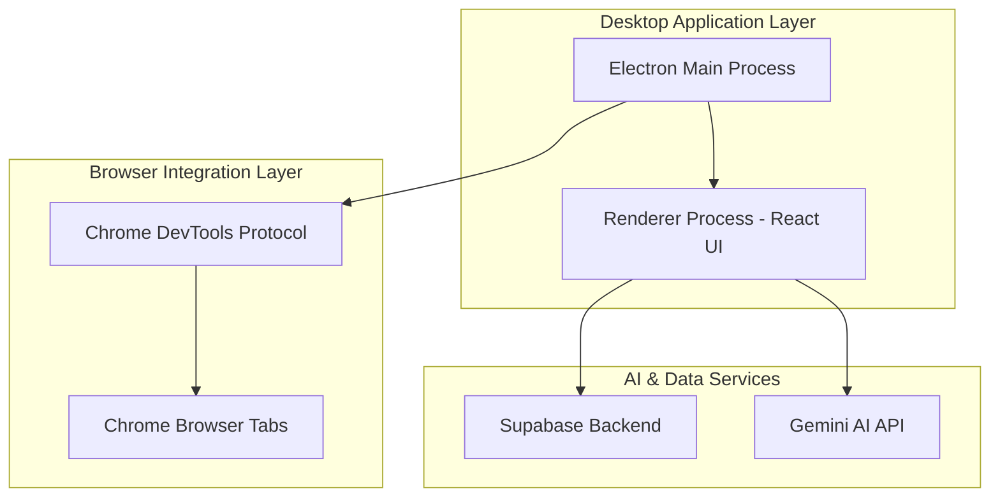
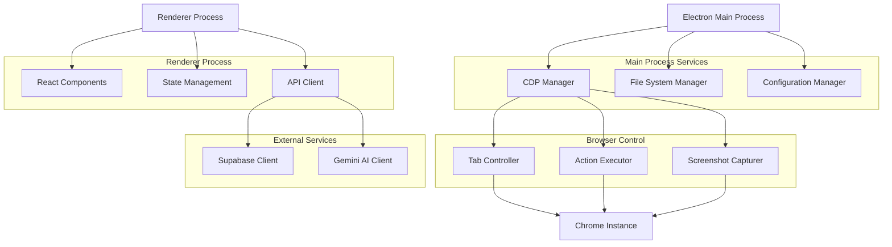
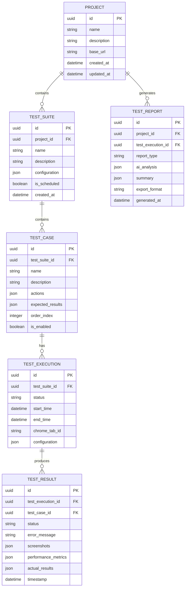

## 1. Architecture design



## 2. Technology Description

- **Frontend**: Electron + React@18 + TypeScript + TailwindCSS
- **Initialization Tool**: electron-vite
- **Backend**: Supabase (PostgreSQL + Authentication + Storage)
- **AI Integration**: Google Gemini AI API
- **Browser Control**: Chrome DevTools Protocol (CDP)
- **Testing Framework**: Custom CDP wrapper with screenshot comparison
- **Report Generation**: Puppeteer for PDF, custom HTML/JSON generators

## 3. Route definitions

| Route | Purpose |
|-------|---------|
| /dashboard | Main dashboard showing projects and recent activity |
| /tab-selection | Chrome tab browser and selection interface |
| /test-designer | Test case creation and checklist builder |
| /test-runner | Live test execution monitoring |
| /reports | Test results and AI-generated analysis |
| /settings | Application configuration and preferences |
| /project/:id | Specific project view with associated tests |
| /test/:id | Individual test configuration and results |

## 4. API definitions

### 4.1 Chrome DevTools Protocol Integration

```typescript
interface CDPConnection {
  targetId: string;
  sessionId: string;
  websocketUrl: string;
}

interface TabInfo {
  id: string;
  title: string;
  url: string;
  faviconUrl?: string;
  type: 'page' | 'background_page' | 'service_worker';
}

interface TestAction {
  type: 'click' | 'input' | 'navigate' | 'wait' | 'screenshot';
  selector?: string;
  value?: string;
  timeout?: number;
  description: string;
}
```

### 4.2 Gemini AI Integration

```
POST /api/gemini/analyze
```

Request:
| Param Name | Param Type | isRequired | Description |
|------------|------------|------------|-------------|
| screenshots | string[] | true | Base64 encoded screenshot images |
| testResults | object[] | true | Array of test execution results |
| testDescription | string | true | Description of what was tested |

Response:
| Param Name | Param Type | Description |
|------------|------------|-------------|
| analysis | string | AI-generated analysis of test results |
| issuesFound | string[] | List of identified issues |
| recommendations | string[] | Suggested improvements |
| confidence | number | Confidence score (0-1) |

Example:
```json
{
  "screenshots": ["base64image1...", "base64image2..."],
  "testResults": [
    {
      "testId": "login_001",
      "status": "failed",
      "error": "Element not found: #submit-button"
    }
  ],
  "testDescription": "Login functionality test for web application"
}
```

### 4.3 Test Execution API

```
POST /api/tests/execute
```

Request:
| Param Name | Param Type | isRequired | Description |
|------------|------------|------------|-------------|
| testSuiteId | string | true | ID of test suite to execute |
| targetTabId | string | true | Chrome tab ID to test |
| configuration | object | false | Execution configuration options |

## 5. Server architecture diagram



## 6. Data model

### 6.1 Data model definition



### 6.2 Data Definition Language

**Projects Table**
```sql
CREATE TABLE projects (
  id UUID PRIMARY KEY DEFAULT gen_random_uuid(),
  name VARCHAR(255) NOT NULL,
  description TEXT,
  base_url VARCHAR(500) NOT NULL,
  created_at TIMESTAMP WITH TIME ZONE DEFAULT NOW(),
  updated_at TIMESTAMP WITH TIME ZONE DEFAULT NOW()
);

-- Indexes
CREATE INDEX idx_projects_created_at ON projects(created_at DESC);
CREATE INDEX idx_projects_name ON projects(name);
```

**Test Suites Table**
```sql
CREATE TABLE test_suites (
  id UUID PRIMARY KEY DEFAULT gen_random_uuid(),
  project_id UUID REFERENCES projects(id) ON DELETE CASCADE,
  name VARCHAR(255) NOT NULL,
  description TEXT,
  configuration JSONB DEFAULT '{}',
  is_scheduled BOOLEAN DEFAULT false,
  schedule_config JSONB DEFAULT '{}',
  created_at TIMESTAMP WITH TIME ZONE DEFAULT NOW(),
  updated_at TIMESTAMP WITH TIME ZONE DEFAULT NOW()
);

-- Indexes
CREATE INDEX idx_test_suites_project_id ON test_suites(project_id);
CREATE INDEX idx_test_suites_scheduled ON test_suites(is_scheduled);
```

**Test Cases Table**
```sql
CREATE TABLE test_cases (
  id UUID PRIMARY KEY DEFAULT gen_random_uuid(),
  test_suite_id UUID REFERENCES test_suites(id) ON DELETE CASCADE,
  name VARCHAR(255) NOT NULL,
  description TEXT,
  actions JSONB NOT NULL DEFAULT '[]',
  expected_results JSONB NOT NULL DEFAULT '{}',
  order_index INTEGER DEFAULT 0,
  is_enabled BOOLEAN DEFAULT true,
  timeout_seconds INTEGER DEFAULT 30,
  created_at TIMESTAMP WITH TIME ZONE DEFAULT NOW(),
  updated_at TIMESTAMP WITH TIME ZONE DEFAULT NOW()
);

-- Indexes
CREATE INDEX idx_test_cases_suite_id ON test_cases(test_suite_id);
CREATE INDEX idx_test_cases_order ON test_cases(order_index);
CREATE INDEX idx_test_cases_enabled ON test_cases(is_enabled);
```

**Test Executions Table**
```sql
CREATE TABLE test_executions (
  id UUID PRIMARY KEY DEFAULT gen_random_uuid(),
  test_suite_id UUID REFERENCES test_suites(id) ON DELETE CASCADE,
  status VARCHAR(50) NOT NULL CHECK (status IN ('pending', 'running', 'completed', 'failed', 'cancelled')),
  start_time TIMESTAMP WITH TIME ZONE DEFAULT NOW(),
  end_time TIMESTAMP WITH TIME ZONE,
  chrome_tab_id VARCHAR(100),
  configuration JSONB DEFAULT '{}',
  total_tests INTEGER DEFAULT 0,
  passed_tests INTEGER DEFAULT 0,
  failed_tests INTEGER DEFAULT 0,
  created_at TIMESTAMP WITH TIME ZONE DEFAULT NOW()
);

-- Indexes
CREATE INDEX idx_test_executions_suite_id ON test_executions(test_suite_id);
CREATE INDEX idx_test_executions_status ON test_executions(status);
CREATE INDEX idx_test_executions_start_time ON test_executions(start_time DESC);
```

**Test Results Table**
```sql
CREATE TABLE test_results (
  id UUID PRIMARY KEY DEFAULT gen_random_uuid(),
  test_execution_id UUID REFERENCES test_executions(id) ON DELETE CASCADE,
  test_case_id UUID REFERENCES test_cases(id) ON DELETE CASCADE,
  status VARCHAR(50) NOT NULL CHECK (status IN ('pass', 'fail', 'skip', 'error')),
  error_message TEXT,
  screenshots JSONB DEFAULT '[]',
  performance_metrics JSONB DEFAULT '{}',
  actual_results JSONB DEFAULT '{}',
  execution_time_ms INTEGER,
  timestamp TIMESTAMP WITH TIME ZONE DEFAULT NOW()
);

-- Indexes
CREATE INDEX idx_test_results_execution_id ON test_results(test_execution_id);
CREATE INDEX idx_test_results_case_id ON test_results(test_case_id);
CREATE INDEX idx_test_results_status ON test_results(status);
CREATE INDEX idx_test_results_timestamp ON test_results(timestamp DESC);
```

**Test Reports Table**
```sql
CREATE TABLE test_reports (
  id UUID PRIMARY KEY DEFAULT gen_random_uuid(),
  project_id UUID REFERENCES projects(id) ON DELETE CASCADE,
  test_execution_id UUID REFERENCES test_executions(id) ON DELETE CASCADE,
  report_type VARCHAR(50) NOT NULL,
  ai_analysis JSONB DEFAULT '{}',
  summary JSONB DEFAULT '{}',
  export_format VARCHAR(20) CHECK (export_format IN ('html', 'pdf', 'json')),
  file_path VARCHAR(500),
  generated_at TIMESTAMP WITH TIME ZONE DEFAULT NOW()
);

-- Indexes
CREATE INDEX idx_test_reports_project_id ON test_reports(project_id);
CREATE INDEX idx_test_reports_execution_id ON test_reports(test_execution_id);
CREATE INDEX idx_test_reports_generated_at ON test_reports(generated_at DESC);
```

**Row Level Security Policies**
```sql
-- Enable RLS
ALTER TABLE projects ENABLE ROW LEVEL SECURITY;
ALTER TABLE test_suites ENABLE ROW LEVEL SECURITY;
ALTER TABLE test_cases ENABLE ROW LEVEL SECURITY;
ALTER TABLE test_executions ENABLE ROW LEVEL SECURITY;
ALTER TABLE test_results ENABLE ROW LEVEL SECURITY;
ALTER TABLE test_reports ENABLE ROW LEVEL SECURITY;

-- Grant permissions
GRANT SELECT ON projects TO anon;
GRANT ALL ON projects TO authenticated;
GRANT SELECT ON test_suites TO anon;
GRANT ALL ON test_suites TO authenticated;
GRANT SELECT ON test_cases TO anon;
GRANT ALL ON test_cases TO authenticated;
GRANT SELECT ON test_executions TO anon;
GRANT ALL ON test_executions TO authenticated;
GRANT SELECT ON test_results TO anon;
GRANT ALL ON test_results TO authenticated;
GRANT SELECT ON test_reports TO anon;
GRANT ALL ON test_reports TO authenticated;
```